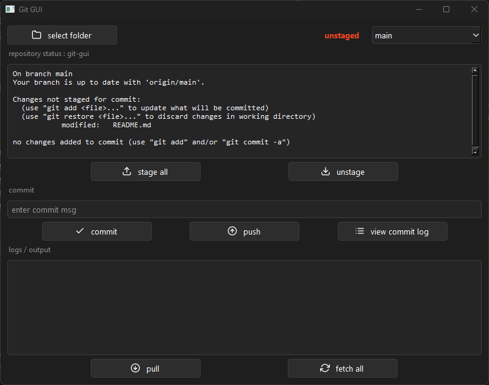
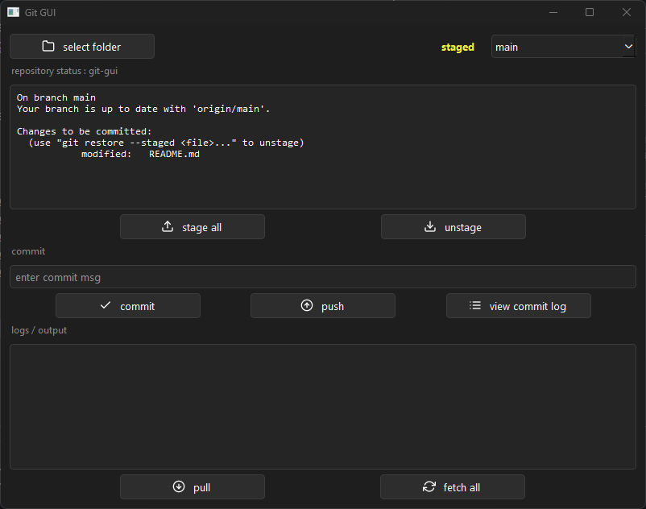
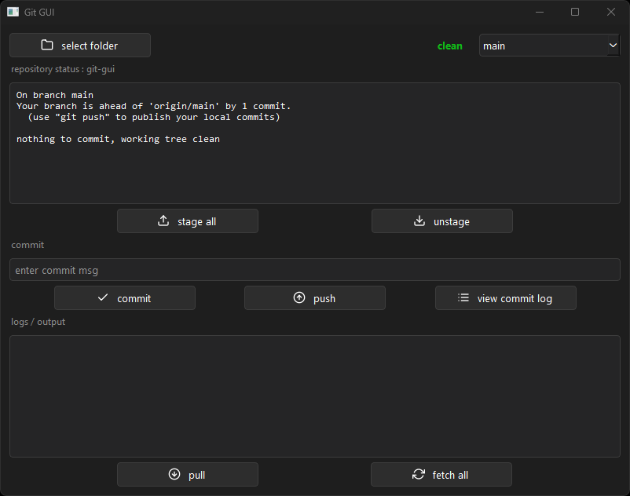

here's the updated README:

---

# git-gui

A lightweight desktop Git client built with Python and PySide6.





## Why

Honestly started as a random idea — wanted to see if I could integrate Git operations into a Python desktop app. Built the whole thing, then realized GitHub Desktop exists. Whoops 😅. Still worth it though.

## Features

- Folder selection with automatic Git repo detection
- Live repo status with staged/unstaged/clean indicator
- Stage all changes or unstage with one click
- Commit with message validation
- Push, pull, and fetch all with error handling
- Branch switching via dropdown
- Commit log viewer (last 5 commits)
- Animated spinner during git operations
- All git operations run on background threads — UI stays responsive

## Setup

```bash
pip install PySide6
python main.py
```

Or download the latest exe from [Releases](https://github.com/kaydee001/git-gui/releases).

## Stack

Python · PySide6 · subprocess · QThread

## Structure

```
main.py       # entry point
ui.py         # MainWindow, layouts, widgets
git_ops.py    # git operations mixin
worker.py     # QThread worker for background git commands
style.qss     # stylesheet
```

---