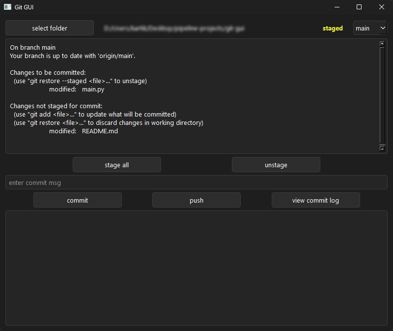

# git-gui

A lightweight desktop Git client built with Python and PySide6. Built to solve a personal pain point — constantly switching to the terminal for routine Git operations while working on pipeline projects.



## Why

Honestly started as a random idea — wanted to see if I could integrate Git operations into a Python desktop app. Built the whole thing, then realized GitHub Desktop exists. Whoops 😅. Still worth it though.

## Features

- Folder selection with automatic Git repo detection
- Live repo status display with staged/unstaged/clean state indicator
- Stage all changes or unstage with one click
- Commit with message validation
- Push to remote with error handling
- Branch switching via dropdown with signal loop protection
- Last 5 commits viewer

## Setup

```bash
pip install PySide6
python main.py
```

## Stack

Python · PySide6 · subprocess
